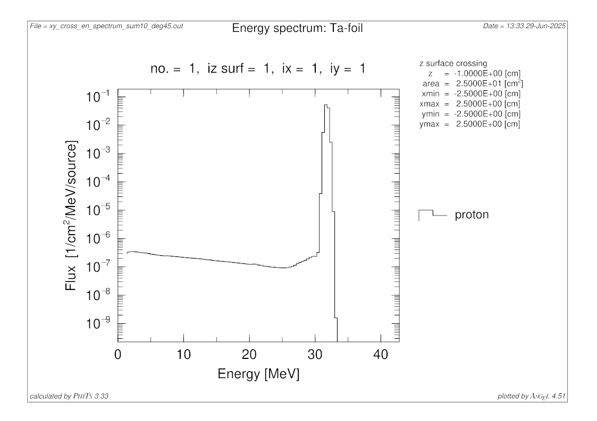
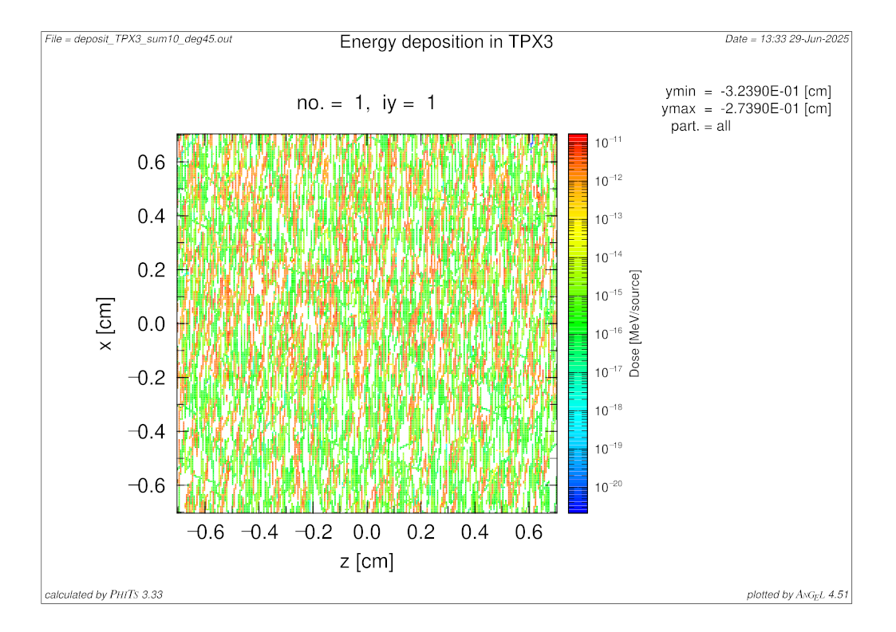

# U-120M proton beam model in PHITS
These are a simulation input parameters for Monte Carlo program [PHITS](https://phits.jaea.go.jp/). Model is used in my Bachelor thesis **Model description of proton beams** for comparation with the experiment done on [cyclotron U-120M](https://www.ujf.cas.cz/en/departments/department-of-accelerators/cyclotron/) in Řež, Czechia. 

Files `bp_model_v1.inp` and `bp_model_v2.inp` are old versions of experiment conducted by C. Granja and his PhD student D. Poklop described in article *Directional-Sensitive Wide Field-of-View Monitoring of High-Intensity Proton Beams by Spectral Tracking of Scattered Particles with Scattering Foil and Miniaturized Radiation Camera* (this article is **not** yet published).  Files `bp_model_v5-1.inp` and `bp_model_v5-sum.inp` are the current versions of the experiment described in the next chapter. `bp_model_v5-1.inp` is the main simulation file that was run 10 times and `bp_model_v5-sum.inp` was used to combine the results. 

File `elastic_scatter_visualization/scatter_model.inp` is for manual output of differential effective cross section to solid angle for proton collision with tantalum. Also provided are Python scripts that visualize the different models used. 

In folder `results_calculation` is a Python script used to calculate the desired result for simulation output files. 

## Experimental setup
- proton beam with average energy of $E=33$ MeV ($FWHM = 0.5$ MeV) on the $Ta$ foil,
- beam divergence of $\pm1.2339\degree$,
- nozzle has a exit window $0.055$ mm thick $Al$ foil, 
- $0.1$ mm thick $Ta$ scatter foil $56$ cm from the nozzle, 
- $Si$ detection element of [MiniPix TPX3](https://advacam.com/camera/minipix-tpx3/) detector $141$ cm perpendicularly to the beam, $141$ cm parallel to the foil ($200$ cm from scatter foil), perpendicularly to scattered paticles and angled at $60$ degrees to the ceiling. 

## Simulation
`$OMP=64` is a command for turning on parallel computing using *OpenMP* with 64 cores (if you aren't using parallelization then just delete the line). 

Variables `cXX` can be used to quickly change detection element position, size, resolution and Ta-foil thickness. 

Aluminium walls around the detector element simulate detector cover. Above the detector element is $0.001$ mm thick $Al$ entrance window and bellow is $0.85$ thick $Si$ ASIC chip with $0.025$ mm air gap. Detector has agle of $60$ degrees to ceiling so that, based on the agles of trajectories, origin of scatter events can be determined. 

`[T-Track]` (Overview) tally is for visualization of the setup and beam geometry. `[T-Track]` (TPX3) tally is to check flux on the detector (there are two addition `[T-Track]` tallies to determine flux between the detector and scatter foil). `[T-Cross]` (Energy spectrum) tally is for determinig energy specrum of the beam in front of the $Ta$ foil and the detector. Main output of the simulation is `[T-Deposit]` and `[T-LET]`, they are for displaying deposited energy $Dose$ and linear energy trasnfer $LET$ in $Si$ detection element of TPX3. 

`[Forced Collisions]` are to improve chances of deflected particles interactions. Geometry is designed in a way, that particles that leave the experiment space and are no longer useful enter into the void where they no longer interact. This saves on computation time. 

`sumtally` section in `bp_model_v5-sum.inp` is used to combine tally results to one. It is used in every tally that you want to combine

## Simulation results

These are the simulation results for $10^{9}$ particles, $30$ batches and $10$ combined output files calculated by `results_calculation/main.py`. Simulations were also done for two more detector positions: 30 and 60 degrees deviated from the main beam (both were 2 m from the $Ta$ scatter foil). 

These are measured values in the detector normalized to source particles. 

|                                            | 30 degress              | 45 degrees             | 60 degrees             |
| :---                                       |   ---:                  |   ---:                 |   ---:                 |
| Flux (1/source)                            | $1,87$ $(6)$ $10^{-7}$  | $2,5$ $(2)$ $10^{-8}$  | $1,3$ $(2)$ $10^{-8}$  |
| Deposited energy (MeV/source)              | $1,800$ $(5)$ $10^{-7}$ | $2,57$ $(2)$ $10^{-8}$ | $1,12$ $(2)$ $10^{-8}$ |
| Deposited energy from protons (MeV/source) | $1,800$ $(5)$ $10^{-7}$ | $2,54$ $(2)$ $10^{-8}$ | $1,11$ $(2)$ $10^{-8}$ |

## Simulation output

These are the simulation outputs for $10^{9}$ particles, $30$ batches and $10$ combined output files.  

- Particle flux in $xz$ plane, at position $(0;0)$ is $Ta$ scatter foil, primary beam behind scatter foil is ignored.

- Proton energy spectrum $1$ cm in front of the scatter foil. 

- Proton energy spectrum $1$ cm behind the scatter foil. 

- Deposited energy in detector element. 

- Proton energy spectrum on the detector. 

